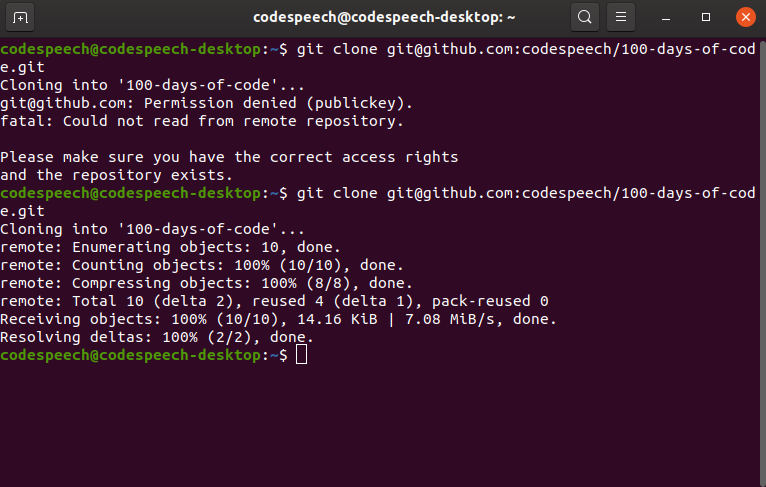

## Day1:
I created a github repo [#100DaysOfCode](https://github.com/codespeech/100-days-of-code) to store my project updates. As soon as I tried to clone this newly added repo on my local, I got following error:


I found this great [documentation](https://help.github.com/en/github/authenticating-to-github/connecting-to-github-with-ssh) about connection github account with ssh on github.

So as per the documentation, first I need to create a new private,public ssh key pair. To do that I ran following command

```ssh-keygen -t rsa -b 4096 -C "your_email@example.com"```

A good documentation about above command can be found [here](https://www.ssh.com/ssh/keygen/).


When we run above command it will ask we for the location of our public and private key pairs. Althought we can store it anywhere we like but I prefer it to keep it under `~/.ssh` directory. The default filename is given id_rsa but we can give a different name. Optionally we can set a password for our keys.

If we have given a different name, or didn't use the default location, then we may need to add newly added ssh private key to ssh-agent for successful authentication.

Let say I named my key to "codespeech" then it will generate two files in my chosen directory, `codespeech` and `codespeech.pub`. The key file without extention `codespeech` is my private key file. To add this file to ssh agent, I ran following command:

```ssh-add [path-to-our-private-key-file]```

Now I need to update the public key file in my github account. Go to [SSH and GPG keys](https://github.com/settings/keys) section in our account section. Click on New [SSH key button](https://github.com/settings/ssh/new) and add content of our public key file there with appropriate name.

Now we can try to clone our repo again and it should not throw any error.




Now it is possible that we want to use different github accounts on the same machine. So we may need to setup a config file in `~/.ssh` directory.

```
# Default account
Host github.com
   HostName github.com
   User git
   IdentityFile ~/.ssh/[private_key_file1]

# Work account-1
Host github.com-[identifier2]    
   HostName github.com
   User git
   IdentityFile ~/.ssh/[private_key_file2]
```

We just need to make sure that host name of git url matches with the host name setup in config file.