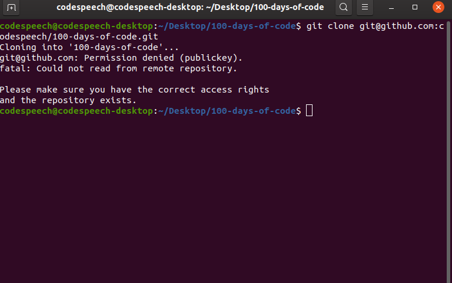
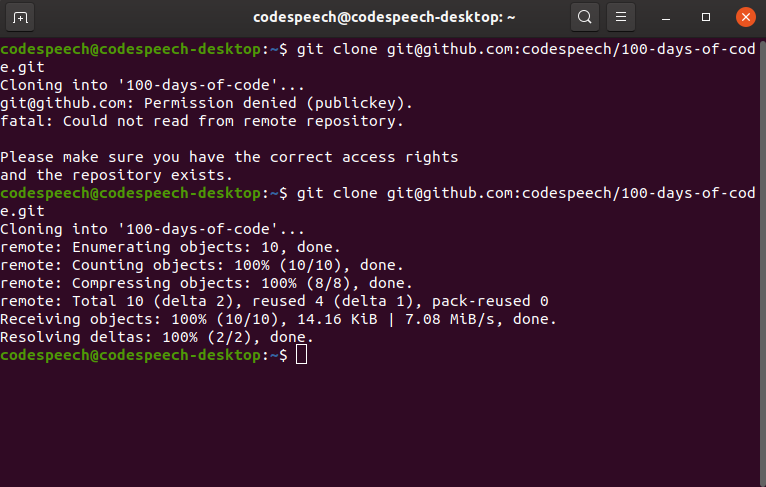

## Day1:
I created a github repo [#100DaysOfCode](https://github.com/codespeech/100-days-of-code) to store my project updates. As soon as I tried to clone this newly added repo on my local, I got following error:




I found this great [documentation](https://help.github.com/en/github/authenticating-to-github/connecting-to-github-with-ssh) about connection github account with ssh on github.

So as per the documentation, first I need to create a new private,public ssh key pair. To do that I ran following command

```ssh-keygen -t rsa -b 4096 -C "your_email@example.com"```

A good documentation about above command can be found [here](https://www.ssh.com/ssh/keygen/).


When we run above command it will ask we for the location of our public and private key pairs. Althought we can store it anywhere we like but I prefer it to keep it under `~/.ssh` directory. The default filename is given id_rsa but we can give a different name. Optionally we can set a password for our keys.

If we have given a different name, or didn't use the default location, then we may need to add newly added ssh private key to ssh-agent for successful authentication.

Let say I named my key to "codespeech" then it will generate two files in my chosen directory, `codespeech` and `codespeech.pub`. The key file without extention `codespeech` is my private key file. To add this file to ssh agent, I ran following command:

```ssh-add [path-to-our-private-key-file]```

Now I need to update the public key file in my github account. Go to [SSH and GPG keys](https://github.com/settings/keys) section in our account section. Click on New [SSH key button](https://github.com/settings/ssh/new) and add content of our public key file there with appropriate name.

Now we can try to clone our repo again and it should not throw any error.

